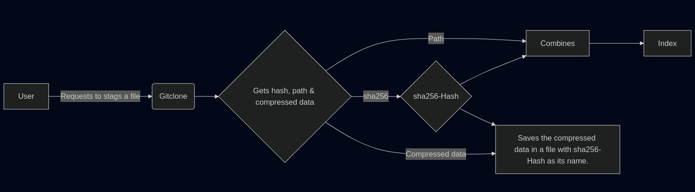
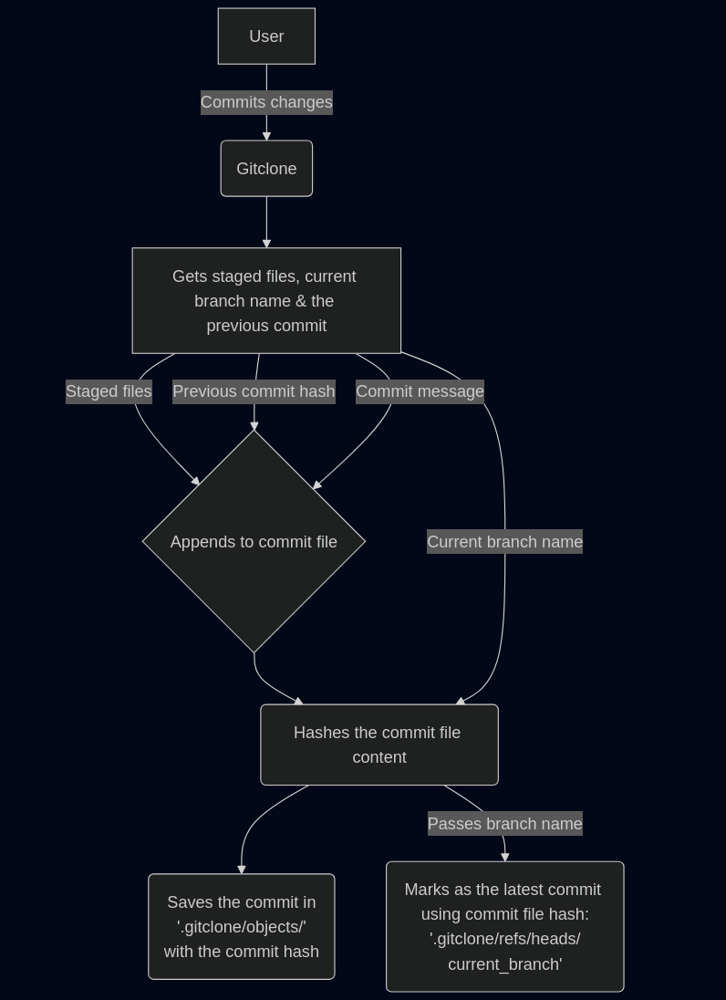
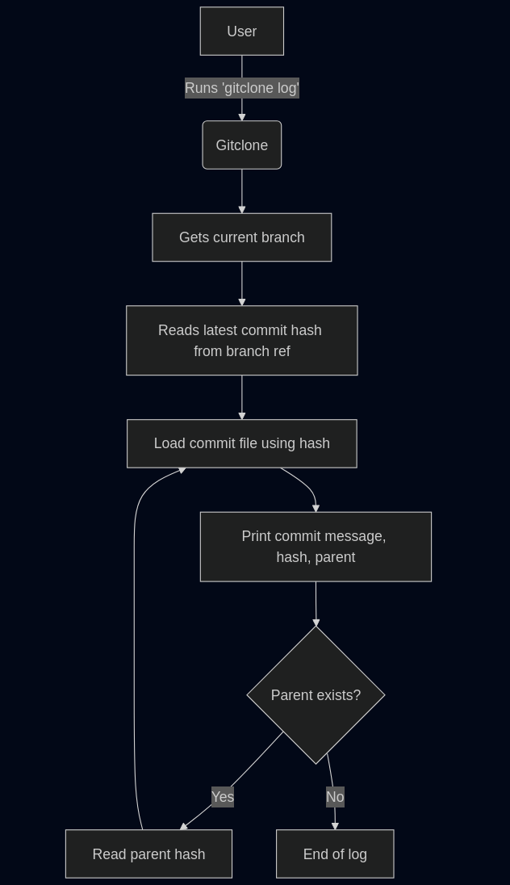
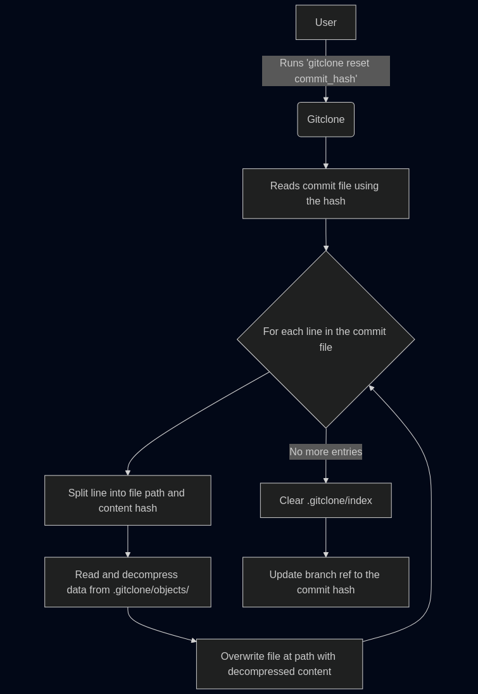
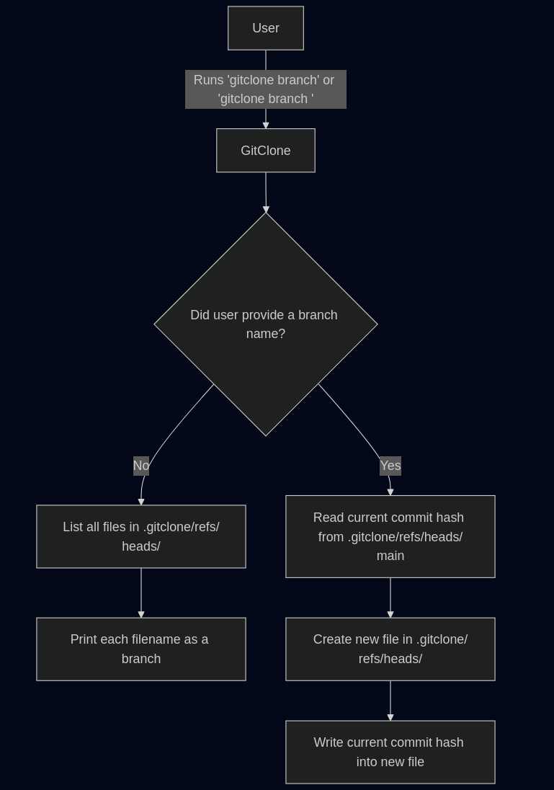

# Gitclone architecture

Here, we will talk about the architecture of gitclone. Since gitclone uses almost the same architecture that of git, you would be able to learn how the core git architecture works.

## Initialization

Let's start off by understanding how the the initialization works.

We run `gitclone init` in the terminal to create a new gitclone repository similar to git.

**It creates:**

- These empty directories: `.gitclone/objects`, `.gitclone/refs/`, `.gitclone/refs/heads/` and `.gitclone/refs/heads`.
- An empty file: `.gitclone/index`
- A file that points to the current branch: `.gitclone/HEAD`

These are the files and directories which will help us build the core of Git.
If you check the `.git` file of a Git repository, then you would find the same files and directories as well because these are the core Git.

## Staging

Now, let's talk about staging.
This is the step where git saves the path to the files that will be captured in a new commit.

You can stage a file in gitclone by running the following command:

```bash
gitclone add <fileName>

# OR

gitclone add . # stages all files in the current directory and the following subdirectories.
```

Now, let's see how staging actually works.

When you stage a file, first, gitclone takes the absolute path of the file and then hashes the file
with sha256.

Now after doing that, we have two variables.

- **Variable-1**: Holds the absolute path to the file
- **Variable-2**: Holds the sha256 hash of the contents of the file

Then, we create a file in `.gitclone/objects` with the name exactly as the data of Variable-2 (The sha256 hash will be the file name). This file will hold the compressed version of the data that the staged file had.

After that, these two variables are appened into the `.gitclone/index` in this format so that we can find which file in `.gitclone/objects` holds the compressed data of which file:

```css
Variable-1 > Variable-2
```

So, `.gitclone/index` would look something like this:

```css
/home/user/Documents/GitClone/file1 > sha265hash1
/home/user/Documents/GitClone/file2 > sha265hash2
```

Here is a diagram that shows this in more detail:



## Commits

When we commit with `gitclone commit -m "commit-message"`, it first fetches all the data from `.gitclone/index` and saves it in a variable. Let's call that variable `indexData`.

After we fetch the `indexData`, gitclone will now proceed to fetching the name of the current branch.

It is in `.gitclone/HEAD` where the name of the current branch is stored.

For example, this will be the default content of `.gitclone/HEAD`

```yaml
refs: refs/heads/main
```

See the `main` written at the end? That is the name of the current branch.

So, gitclone then fetches the name and reads the contents of `.gitclone/refs/heads/<branch_name>` and stores it in a variable (the contents of `.gitclone/refs/heads/<branch_name>` will point to the previous commit). Let's call that variable `commitParent` (**parent commit** is also known as **the previous commit**).

Now that gitclone has both the `indexData`, the branch name and the `commitParent`, it can now finally proceed to storing this commit.

First, gitclone injects the entire `indexData` into this commit, then appends the `commitParent` and the commit message at the end of the commit file to complete the contents of a commit. Now the final part is just to save the commit.

So, before saving the commit, gitclone hashes the contents of this commit using sha256 and stores it in `.gitclone/objects/` with the file name as the sha256 hash.

Now the commit is finally stored. But it's not over yet! It needs to mark down that this is the latest commit, so it replaces the content of `.gitclone/refs/heads/branch_name` with the sha256 hash of the commit.

And this marks the end of how gitclone saves a commit.

Here is a diagram to help you understand how it works more:



## Logging commits

Phew, we are past the complex area! Now everything will be peaceful frm now on.

Anyway, let's get back to our topic, logging commits. We do `gitclone log` to log all the commits that we have ever done.

Let's learn how that works.

First of all, it reads the `.gitclone/HEAD` file to find the currently active branch (as we discussed in [the commits section](#commits)). After that, it reads the `.gitclone/refs/heads/branch_name` to find what the latest commit is.

Now gitclone has the commit hash of the latest commit. So, it logs the commit hash and commit message from the `.gitclone/objects/commit_hash`.

Now, the main part is over, now it's pretty smooth.

Gitclone uses the [commitParent](#commit) to find the previous commit hash and then vists `.gitclone/objects/parent_commit_hash` to log the parent commit hash and it's commit message.

This continues until the commit file which has the [commitParent](#commit) value as `none`.



## Resetting

Now the final part of the core of Git. Resetting to a previous commit.

In gitclone we run `gitclone reset <commit_hash>` to hard reset to that particualar hash.

Currently gitclone reset always does hard rests where as Git has mutiple reset options like --soft, --hard etc. So, due to this problem, we will only talk about the hard reset.

So, first of all, it gets the commit hash of the commit file from the command (`gitclone reset <commit_hash>` -- The third argument). Then, it reads the absolute path of each file listed in the commit file and their respective content hash. Then, it decompresses the content hash and replaces the contents of the currently read file with the decompressed data.

So, basically if the commit file looks smth like this:

```toml
/home/user/Documents/GitClone/exampleFile1 > awci9SkRqPjPJTMG7gRZVt+ER50CHYDK+jE2l6x9pkk=
/home/user/Documents/GitClone/exampleFile2 > xKbd5jWrTehvdmoPXfO6QF9YWOAud4Bz2adEBGiqJfc=
...
```

then, first it reads the absolute file path `/home/user/Documents/GitClone/exampleFile1` then replaces the contents of that file with the decompressed data of the compressed data inside `.gitclone/objects/awci9SkRqPjPJTMG7gRZVt+ER50CHYDK+jE2l6x9pkk=`. This is repeated for each entry in the commit file and that is how resetting works.



## Making/Logging branches

```bash
gitclone branch # logs all branches

gitclone branch example # create a branch named example
```

This is how we log/make new branches in gitclone. And the code behind is actually pretty easy!

If we are logging all branches, all that we have to do is to list the names of all files inside `.gitclone/refs/heads/`

And for creating branches, all it does is just create a new file in `.gitclone/refs/heads/` with the name of the branch you provided and add the contents of `.gitclone/refs/heads/main` into our new branch.



## Switching branches

```bash
gitclone switch <branch_name>
```

This is how we switch to a different branch in gitclone. All gitclone has to do to swtich branches is just to make `.gitclone/HEAD` point to the branch that we are switching to.

## Conclusions

This is how gitclone works. And moreover, **THIS IS ALMOST HOW GIT WORKS**. The reason why I said **almost** is because of the fact that I changed a few things to simplify making **gitclone**.
